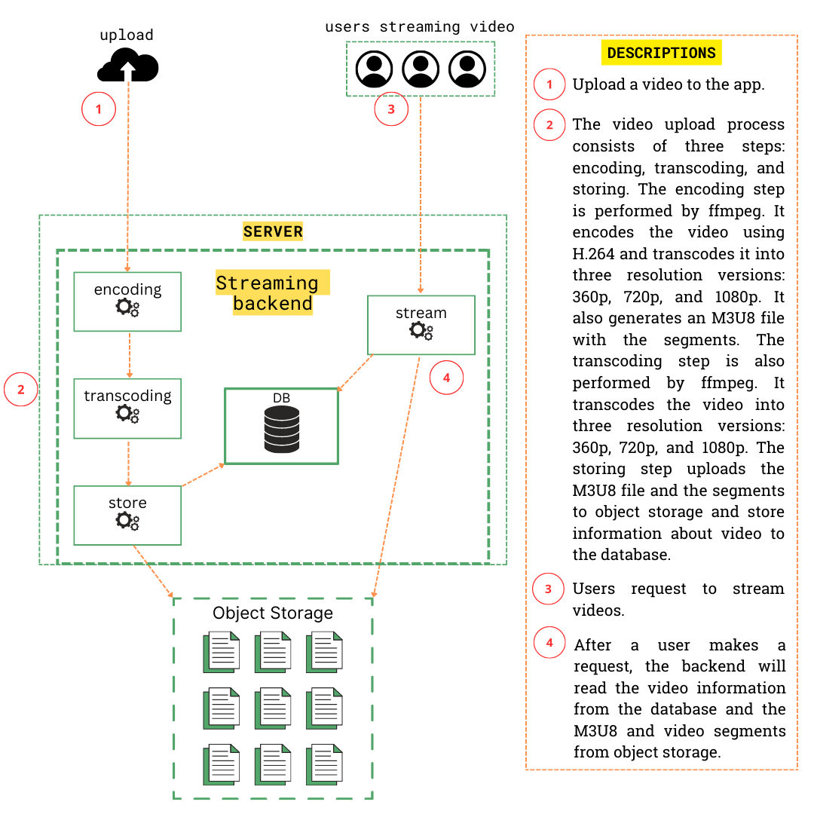

## Introduction
This Web API has functionality as VOD(Video On Demand) streaming backend. I created this Web API as a portfolio to learn about how video streaming works, and video processing like encoding and transcoding. I also learned how
to integrate object storage with app service. I build this Web API using Go Programming language and use FFMPEG for video processing. I also implemented HLS(HTTP Video Livestreaming).

## Tech Stacks
The tech stack that I used to build this is

[![Go][Go]][Go_URL] [![FFMPEG][FFMPEG]][FFMPEG_URL] [![MYSQL][MYSQL]][MYSQL_URL] [![JWT][JWT]][JWT_URL]
<ul>
  <li>Go programming language</li>
  <li>FFMPEG</li>
  <li>MYSQL</li>
  <li>JWT</li>
 </ul>

 Lib that I used on this project

 * [github.com/go-sql-driver/mysql](https://github.com/go-sql-driver/mysql)
 * [github.com/golang-jwt/jwt](https://github.com/golang-jwt/jwt)
 * [github.com/gorilla/mux](https://github.com/gorilla/mux)
 * [github.com/joho/godotenv](https://github.com/joho/godotenv)
 * [golang.org/x/crypto](https://pkg.go.dev/golang.org/x/crypto)
 * [github.com/oklog/ulid/v2](https://github.com/oklog/ulid)
 * [github.com/aws/aws-sdk-go](https://github.com/aws/aws-sdk-go)

   
[Go]: https://img.shields.io/badge/go-%2300ADD8.svg?style=for-the-badge&logo=go&logoColor=white
[Go_URL]: https://go.dev/
[FFMPEG]: https://a11ybadges.com/badge?logo=ffmpeg
[FFMPEG_URL]: https://www.ffmpeg.org/
[MYSQL]: https://img.shields.io/badge/mysql-%2300f.svg?style=for-the-badge&logo=mysql&logoColor=white
[MYSQL_URL]: https://www.mysql.com/
[JWT]: https://img.shields.io/badge/JWT-black?style=for-the-badge&logo=JSON%20web%20tokens
[JWT_URL]: https://jwt.io/

## System Design Schema

